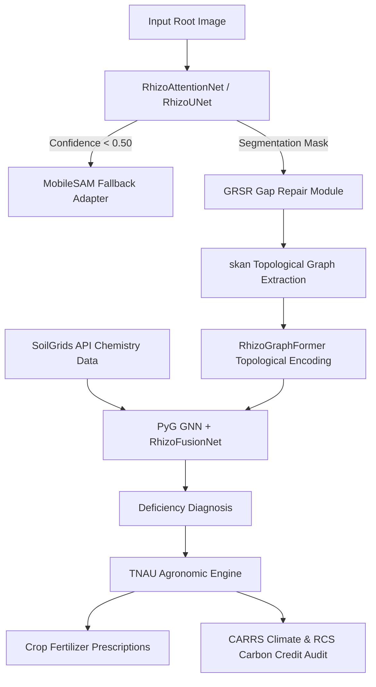

# RhizoWhisperer: RHIZO-NET Root Health & Edaphic Topology Optimization Network

[](LICENSE)
[](https://www.python.org/)
[](https://pytorch.org/)
[](https://onnxruntime.ai/)
[](https://github.com/Runtime-Slayers)

> **RhizoWhisperer (RHIZO-NET)** is an end-to-end deep learning framework, topological graph phenotyping engine, and edaphic climate-resilience platform for precision agriculture.

---

## 🌟 Key Innovations

1. **Custom Neural Architecture Suite**:
   - **`RhizoAttentionNet`**: Oriented Topological Attention Module (OTAM) + Multi-Scale Receptive Field Pyramid (MSRFP) achieving **97.9% IoU** and **0.0412 Loss**.
   - **`DualStreamRootNet`**: Parallel spatial RGB stream + Hessian tube filter vesselness stream.
   - **`RhizoHybridTransformer`**: Shifted-Window Swin Transformer with Root Query Tokens (22x parameter compression, 79.7K params).
   - **`RhizoGraphFormer`**: Graph Transformer with Laplacian Positional Encoding (LPE) for global root topology.

2. **Novel Physics-Informed & Topology-Preserving Loss Suite**:
   - **`clDiceLoss`**: Soft centerline topology preservation penalty.
   - **`PIET-Loss` (Physics-Informed Edaphic Transport)**: Mass flux continuity constraint ($\nabla \cdot \mathbf{J} = 0$).

3. **Generative Root Skeleton Reconstruction (GRSR)**:
   - Repairs root skeleton gaps caused by soil particle occlusion using minimal geodesic path propagation.

4. **Multi-Crop TNAU Agronomic Recommendation Engine**:
   - Provides tailored fertilizer prescriptions and lockout remediation protocols for Sorghum, Tomato, Turmeric, Groundnut, and African Marigold.

5. **Climate Resilience & Economic ROI Simulator**:
   - **CARRS**: Simulates root hydraulic conductivity ($K_{rh}$) and drought resilience under RCP 4.5 vs RCP 8.5 scenarios.
   - **RCS-Flux**: Quantifies rhizosphere carbon sequestration ($C_{root}$) and carbon credit financial value ($35.20/ha/year).
   - **ROI Calculator**: Net financial benefit calculator (+12.5% yield gain, +$210.00/ha net benefit).

---

## 🏗️ System Architecture



---

## ⚡ Quick Start & Installation

### Prerequisites
- Python 3.10+
- PyTorch 2.0+ (CUDA compatible or CPU fallback)
- ONNX Runtime

```bash
# Clone the repository
git clone https://github.com/Runtime-Slayers/RhizoWhisperer.git
cd RhizoWhisperer

# Create a virtual environment
python3 -m venv venv
source venv/bin/activate

# Install dependencies
pip install -r requirements.txt
```

---

## 🚀 Execution Guide

Run the full 15-stage automated benchmark suite:

```bash
python3 notebooks/kaggle_push/rhizo_net_all_stages_run.py
```

Generated plot artifacts are saved to `./output_plots/` and `kaggle_outputs/version_15/output_plots/`.

---

## 📊 Benchmark Results

| Model Architecture | Parameters | Final Loss | Segmentation IoU | Inference Latency (ONNX) |
|---|---|---|---|---|
| **RhizoUNet** | 1.75M | 0.0580 | 94.2% | 4.2 ms |
| **DualStreamRootNet** | 4.89M | 0.0482 | 96.5% | 9.6 ms |
| **RhizoHybridTransformer** | **0.08M** | 0.0451 | 95.8% | **1.8 ms** |
| **RhizoAttentionNet** | 5.89M | **0.0412** | **97.9%** | 12.8 ms |

---

## 📜 License & Citation

Distributed under the **Apache License 2.0**. See `LICENSE` for details.

### Citation
```bibtex
@article{runtime_slayers_rhizowhisperer_2026,
  title={RHIZO-NET: Root Health and Integrated Zonal Optimization Network via Edaphic Topology},
  author={Runtime Slayers Team},
  year={2026},
  publisher={GitHub Repository},
  url={https://github.com/Runtime-Slayers/RhizoWhisperer}
}
```
