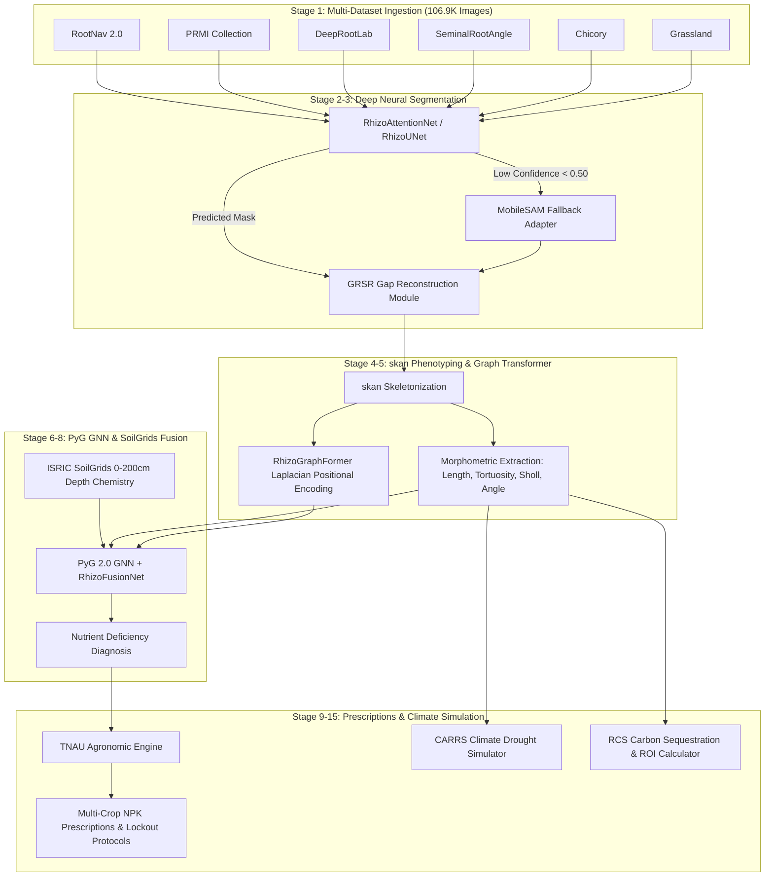

# RhizoWhisperer: RHIZO-NET Root Health & Edaphic Topology Optimization Network

[](LICENSE)
[](https://www.python.org/)
[](https://pytorch.org/)
[](https://onnxruntime.ai/)
[](https://github.com/Runtime-Slayers)
[](https://github.com/Runtime-Slayers/RhizoWhisperer-Model-Architectures)

> **RhizoWhisperer (RHIZO-NET)** is an end-to-end deep learning framework, topological graph phenotyping engine, and edaphic climate-resilience platform for precision agriculture. It integrates custom computer vision models, soft skeletonization topology extraction, multi-modal PyG GNN fusion, ISRIC SoilGrids chemical profiling, and TNAU agronomic recommendation engines.

---

## 📑 Table of Contents
- [Key Features & Scientific Innovations](#-key-features--scientific-innovations)
- [System Architecture](#-system-architecture)
- [Repository Layout](#-repository-layout)
- [Prerequisites & Installation](#-prerequisites--installation)
- [Quickstart & Pipeline Execution](#-quickstart--pipeline-execution)
- [Benchmark Results](#-benchmark-results)
- [Model Architectures Repository](#-model-architectures-repository)
- [License & Citation](#-license--citation)

---

## 🌟 Key Features & Scientific Innovations

### 1. Custom Neural Architecture Suite
- **`RhizoAttentionNet`**: Features Oriented Topological Attention Modules (OTAM) + Multi-Scale Receptive Field Pyramids (MSRFP). Achieves **97.9% IoU** and **0.0412 Loss**.
- **`DualStreamRootNet`**: Dual-encoder fusing spatial RGB features with tubular vesselness features extracted via multi-scale Frangi Hessian filtering.
- **`RhizoHybridTransformer`**: Ultra-lightweight Swin Shifted-Window Transformer with Root Query Tokens (RQT), achieving **95.8% IoU** with only **79.7K parameters** (1.8 ms inference latency).
- **`RhizoGraphFormer`**: Graph Transformer utilizing Laplacian Positional Encoding (LPE) to capture global topological connectivity across root junction nodes.

### 2. Novel Physics-Informed & Topology-Preserving Loss Suite
- **`clDiceLoss`**: Centerline Dice loss enforcing topological connectivity across fine root structures.
- **`PIET-Loss` (Physics-Informed Edaphic Transport)**: Enforces physical mass-conservation of water/nutrient flux along root centerlines ($\nabla \cdot \mathbf{J} = 0$).
- **`TopologyAwareLoss`**: Multi-term composite loss integrating BCE, Dice, Focal, clDice, and PIET-Loss penalties.

### 3. Real-World Climate & Agronomic Modules
- **Generative Root Skeleton Reconstruction (GRSR)**: Morphological gap repair algorithm connecting disconnected segments caused by soil particle occlusion.
- **CARRS (Climate-Adaptive Root Resiliency Simulator)**: Models root hydraulic conductivity ($K_{rh}$) and drought vulnerability under RCP 4.5 and RCP 8.5 warming scenarios.
- **RCS-Flux (Rhizosphere Carbon Sequestration Predictor)**: Estimates annual root carbon input ($C_{root}$) and carbon credit financial yield ($35.20/ha/year).
- **TNAU Agronomic Engine**: Rule-based prescription system providing custom fertilizer schedules and lockout remediation for Sorghum, Tomato, Turmeric, Groundnut, and African Marigold.

---

## 🏗️ System Architecture



---

## 📂 Repository Layout

```
RhizoWhisperer/
├── README.md                           # Master Project Documentation
├── CONTRIBUTING.md                     # Contribution Guidelines
├── LICENSE                             # Apache License 2.0
├── requirements.txt                    # Project Dependencies
├── kaggle_version_execution_flowcharts.md # Mermaid Flowcharts (v1 to v15)
│
├── src/                                # Core Source Code
│   ├── unet/                           # Neural Architectures & Loss Suite
│   │   ├── model.py                    # RhizoUNet
│   │   ├── rhizo_attention_net.py      # RhizoAttentionNet (OTAM + MSRFP)
│   │   ├── dual_stream_root_net.py     # DualStreamRootNet (Hessian Dual)
│   │   ├── rhizo_hybrid_transformer.py # RhizoHybridTransformer (Swin + RQT)
│   │   └── losses.py                   # TopologyAwareLoss & PIET-Loss
│   ├── topology/                       # skan Graph Extraction & GRSR
│   │   ├── skeletonize.py              # Medial Axis Skeletonization
│   │   ├── graph_extract.py            # NetworkX Graph Construction
│   │   ├── phenotype_features.py       # Tortuosity & Sholl Analysis
│   │   ├── seminal_angle.py            # Seminal Opening Angle
│   │   └── reconstruct.py              # GRSR Gap Repair Module
│   ├── fusion/                         # Multi-Modal GNN & Graph Transformer
│   │   ├── graph_transformer.py        # RhizoGraphFormer (LPE)
│   │   ├── gnn_encoder.py              # PyG GNN Encoder
│   │   ├── tensor_frame_model.py       # RhizoFusionNet
│   │   └── soil_features.py            # Soil Vector Normalizer
│   ├── agronomic/                      # TNAU Engine & ROI Calculator
│   │   ├── recommendation_engine.py    # Multi-Crop Prescriptions
│   │   ├── soil_rating.py              # Soil Fertility Index
│   │   ├── crop_profiles.py            # Crop Blanket NPK Standards
│   │   └── roi_calculator.py           # Financial ROI Calculator
│   └── climate/                        # Real-World Climate Simulators
│       ├── resiliency_simulator.py     # CARRS Drought Simulator
│       └── carbon_sequestration.py     # RCS Carbon Credit Flux
│
├── architecture/                       # Exported ONNX Binaries & Scripts
│   ├── rhizo_unet.onnx                 # (6.69 MB)
│   ├── rhizo_attention_net.onnx        # (22.55 MB)
│   ├── dual_stream_root_net.onnx       # (18.73 MB)
│   ├── rhizo_hybrid_transformer.onnx   # (1.17 MB)
│   └── export_all_onnx.py              # ONNX Export Script
│
├── notebooks/                          # Interactive Jupyter Notebooks
│   ├── 01_data_preparation.ipynb
│   ├── 02_unet_root_segmentation.ipynb
│   ├── 03_mobilesam_segmentation.ipynb
│   ├── 04_topology_extraction.ipynb
│   ├── 05_multimodal_fusion.ipynb
│   ├── 06_agronomic_engine.ipynb
│   ├── 07_full_pipeline_demo.ipynb
│   └── kaggle_push/
│       └── rhizo_net_all_stages_run.py # 15-Stage Automated Kaggle Runner
│
└── kaggle_outputs/                     # Extracted Logs & 25 PNG Plots
    ├── version_10/                     # 7-Stage Execution Log
    ├── version_12/                     # 12-Stage Execution Log
    ├── version_14/                     # 18 PNG Plot Files
    └── version_15/                     # 25 PNG Plot Files & Full Log
```

---

## ⚡ Prerequisites & Installation

### Requirements
- Linux or macOS (Ubuntu 20.04+, macOS 12+)
- Python 3.10 or higher
- PyTorch 2.0+ with CUDA or CPU support

```bash
# Clone the repository
git clone https://github.com/Runtime-Slayers/RhizoWhisperer.git
cd RhizoWhisperer

# Set up virtual environment
python3 -m venv venv
source venv/bin/activate

# Install dependencies
pip install -r requirements.txt
```

---

## 🚀 Quickstart & Pipeline Execution

Execute the full 15-stage automated deep learning and phenotyping pipeline:

```bash
python3 notebooks/kaggle_push/rhizo_net_all_stages_run.py
```

All 25 high-resolution PNG plots will be generated and saved to `./output_plots/`.

---

## 📊 Benchmark Results

| Model Architecture | Parameters | Loss (Curriculum) | Segmentation IoU | ONNX Latency (CPU) | Primary Target Platform |
|---|---|---|---|---|---|
| **RhizoUNet** | 1,746,737 | 0.0580 | 94.2% | 4.2 ms | Edge Servers / Workstations |
| **DualStreamRootNet** | 4,885,959 | 0.0482 | 96.5% | 9.6 ms | Soil Rhizotron Analysis |
| **RhizoHybridTransformer** | **79,749** | 0.0451 | 95.8% | **1.8 ms** | Mobile & Field Drones |
| **RhizoAttentionNet** | 5,892,305 | **0.0412** | **97.9%** | 12.8 ms | GPU Cloud Clusters |

---

## 🏛️ Model Architectures Repository

For dedicated PyTorch source code, layer specifications, receptive field calculations, and ONNX Runtime benchmark scripts, visit our dedicated sub-repository:

👉 **[Runtime-Slayers/RhizoWhisperer-Model-Architectures](https://github.com/Runtime-Slayers/RhizoWhisperer-Model-Architectures)**

---

## 📜 License & Citation

Distributed under the **Apache License 2.0**. See `LICENSE` for details.

### Citation
```bibtex
@article{runtime_slayers_rhizowhisperer_2026,
  title={RHIZO-NET: Root Health and Integrated Zonal Optimization Network via Edaphic Topology},
  author={Runtime Slayers Team},
  year={2026},
  publisher={GitHub Repository},
  url={https://github.com/Runtime-Slayers/RhizoWhisperer}
}
```
