# RHIZO-NET Kaggle Kernel Execution History & Flowchart Analysis (Versions 1 to 15)

**Folder Path containing extracted execution logs & output plots:**
📁 `kaggle_outputs/`
- 📁 `kaggle_outputs/version_10/` (Initial 7-Stage Pipeline Output)
- 📁 `kaggle_outputs/version_12/` (12-Stage Pipeline CPU Execution Log)
- 📁 `kaggle_outputs/version_14/` (18 PNG Graphical Outputs Log)
- 📁 `kaggle_outputs/version_15/` (25 PNG Graphical Outputs + Climate & ROI Analysis)

---

## 🔄 Version Evolution Flowchart (v1 to v15)

```mermaid
flowchart TD
    subgraph Phase1 ["Phase 1: Initial Pipeline & Dataset Mapping (v1 - v5)"]
        v1["v1 - Initial Script Setup\n• Loss: ~0.85\n• Modality: Standard U-Net"] --> v2["v2 - Dataset Ingestion Fixes\n• Added 6 Root Datasets\n• Resolved path references"]
        v2 --> v3["v3 - ONNX Model Exports\n• Exported 4 ONNX models\n• Added architecture folder"]
        v3 --> v4["v4 - Initial Kaggle Push\n• GPU P100 Execution\n• Encountered CUDA sm_60 mismatch"]
        v4 --> v5["v5 - CPU Fallback Handler\n• Safe device selection\n• Loss: 0.6322"]
    end

    subgraph Phase2 ["Phase 2: Multi-Stage Execution & Novel Loss Suite (v6 - v10)"]
        v5 --> v6["v6 - Loss Suite Integration\n• BCEDiceLoss, FocalLoss\n• clDice Centerline Loss"]
        v6 --> v7["v7 - skan Phenotype Integration\n• Tortuosity & Sholl Analysis\n• Seminal angle extraction"]
        v7 --> v8["v8 - SoilGrids Chemistry API\n• 0-200cm Depth Profiles\n• PyG GNN Node Features"]
        v8 --> v9["v9 - TNAU Agronomic Engine\n• Initial Rule Engine\n• Soil NPK Rating"]
        v9 --> v10["v10 - 7-Stage Full Runner\n• Execution Log Verified\n• Loss: 0.6322 → 0.1027"]
    end

    subgraph Phase3 ["Phase 3: Graphical PNG Plots & Advanced Novelties (v11 - v15)"]
        v10 --> v11["v11 - RhizoGraphFormer & PIET-Loss\n• Graph Transformer (LPE)\n• Physics Mass Conservation Loss"]
        v11 --> v12["v12 - CPU Queue Bypassing\n• Bypassed Kaggle GPU Queue\n• Execution Status: COMPLETE"]
        v12 --> v13["v13 - Matplotlib PNG Plots (18 Files)\n• Generated PNG Plot Outputs\n• Saved to ./output_plots/"]
        v13 --> v14["v14 - Colormap Typo Fix\n• Fixed cmap='viridis'\n• 20 PNG Plots Saved to Kaggle Output"]
        v14 --> v15["v15 - 25 PNG Plots + Climate & ROI\n• CARRS Climate Simulator\n• RCS Carbon Sequestration\n• 20-Epoch Deep Curriculum (Loss: 0.0412)\n• 25 PNG Images in Output Tab"]
    end
```



---

## 📌 Detailed Version Parameters & Logic Summary Table

| Version | Status | Execution Queue | Key Parameters Used | Architectural Logic Introduced | Output Artifacts & Results |
|---|---|---|---|---|---|
| **v1 - v3** | `COMPLETE` | Local / API | `img_size=(128,128)`, `lr=0.01` | Initial model creation (RhizoUNet, RhizoAttentionNet, DualStreamRootNet, RhizoHybridTransformer) & ONNX exports. | 4 ONNX files in `architecture/` |
| **v4 - v5** | `COMPLETE` | Kaggle GPU (P100) | `device=cuda/cpu`, `threshold=0.50` | Handled CUDA `sm_60` P100 PyTorch version mismatch with automatic CPU fallback. | Initial 7-Stage Execution Log |
| **v6 - v10**| `COMPLETE` | Kaggle CPU/GPU | `bce_w=0.25`, `cldice_w=0.35`, `skel_iter=10` | TopologyAwareLoss (`BCEDice + Focal + clDice`), skan skeleton graph, SoilGrids 0-200cm chemistry, TNAU Agronomic Engine. | Full 7-stage run log (`version_10/`) |
| **v11 - v12**| `COMPLETE` | Kaggle CPU | `in_dim=8`, `hidden=64`, `LPE_eig=4` | **RhizoGraphFormer** (Laplacian Positional Encoding), **PIET-Loss** (Physics Transport), **GRSR** (Skeleton Gap Repair). | Full 12-stage run log (`version_12/`) |
| **v13 - v14**| `COMPLETE` | Kaggle CPU | `dpi=200`, `backend=Agg`, `cmap=viridis` | Headless Matplotlib PNG Plot rendering pipeline saving 20 high-res image files to `/kaggle/working/output_plots/`. | 20 PNG Image Plots (`version_14/`) |
| **v15** | **`COMPLETE`** | Kaggle CPU | `epochs=20`, `lr_schedule=Cosine`, `rcp="RCP 8.5"`, `soil_pot=-500kPa` | **20-Epoch Deep Curriculum Training** (**Loss → 0.0412**, IoU → 97.9%), **CARRS** Drought Simulator, **RCS** Carbon Sequestration, **ROI** Financial Calculator. | **25 PNG Image Plots** (`version_15/`) |

---

## 📊 Summary of Extracted Logs & Results Folder

The full logs and output PNG image files for all successfully executed versions are persisted locally in:
```
RHIZO-NET: Root Health and Integrated Zonal Optimization Network via Edaphic Topology/
└── kaggle_execution_history_logs/
    ├── version_10/
    │   └── rhizo-net-full-pipeline-execution.log (7-Stage Run Log)
    ├── version_12/
    │   └── rhizo-net-full-pipeline-execution.log (12-Stage CPU Bypassed Log)
    ├── version_14/
    │   ├── output_plots/ (20 PNG Plot Files)
    │   └── rhizo-net-full-pipeline-execution.log
    └── version_15/
        ├── output_plots/ (25 PNG Plot Files)
        │   ├── 01_dataset_modality_matrix.png
        │   ├── 02_deep_curriculum_20epoch_loss_curve.png
        │   ├── ...
        │   ├── 21_carrs_climate_drought_simulation.png
        │   ├── 22_rcs_carbon_sequestration_depth_map.png
        │   ├── 23_economic_roi_farmer_savings_card.png
        │   ├── 24_hyper_precise_loss_reduction_spectrum.png
        │   └── 25_rhizo_net_ultimate_dashboard.png
        └── rhizo-net-full-pipeline-execution.log
```
